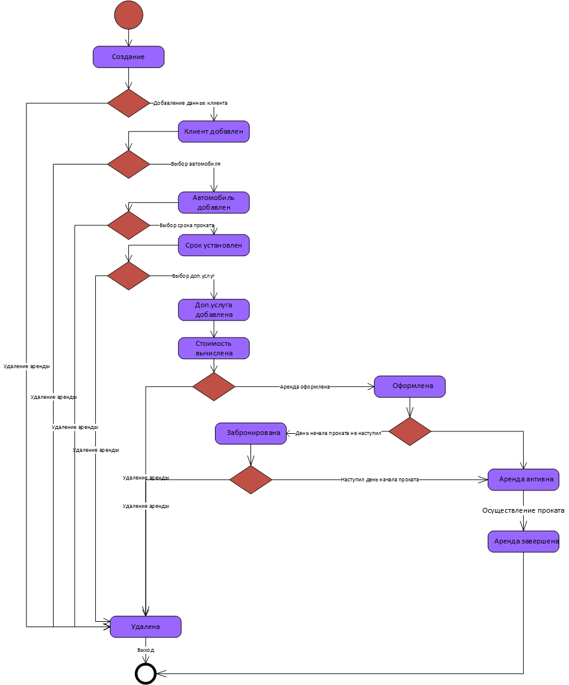

# Диаграмма состояний аренды

Диаграмма описывает все возможные состояния аренды на продолжении ее жизненного цикла. Исходная аренда является пустой, далее, после добавления клиента, добавления аренды, добавления дополнительной услуги,
пределяется стоимость.
После подтверждения всех аспектов продажа переходит в состояние "Оформлена". Если дата начала проката еще не наступила, то аренда переходит в состояние "Забронирована".
В противном случае аренда переходит в состояние "активна"
