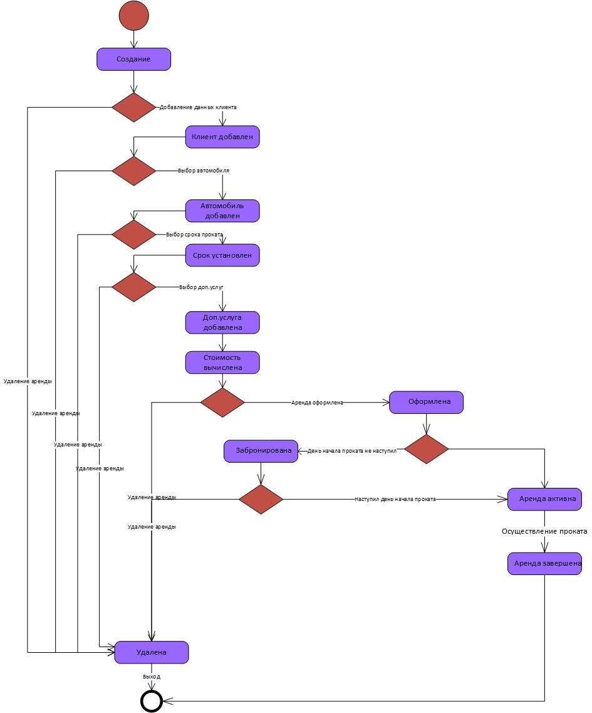

# Назначение программы:

Данная АИС разрабатывается для автоматизации управления деятельности фирмы проката автомобилей.

Основные цели создания программы:
- Приращение эффективности работы фирмы
- Повышение производительности труда рабочего персонала
- Снижение времени оформления заявки
- Формирование единой информационной базы
- Сбор и анализ статистики
## Диаграмма классов

### Список классов

- [Client](Docs/Classes/Client.md "Класс Client")
- [Person](Docs/Classes/Person.md "Класс Person")
- [Employee](Docs/Classes/Employee.md "Класс Employee")
- [Equipment](Docs/Classes/Equipment.md "Класс Equipment")
- [Rent](Docs/Classes/Rent.md "Класс Rent")
- [Service](Docs/Classes/Service.md "Класс Service")
- [Car](Docs/Classes/Car.md "Класс Car")

## Диаграмма интерфейсов

### Список интерфейсов

- [IRent](Docs/Interfaces/IRent.md "Интерфейс IRent")
- [IClient](Docs/Interfaces/IClient.md "Интерфейс IClient")
- [IEmployee](Docs/Interfaces/IEmployee.md "Интерфейс IEmployee")
- [IEquipment](Docs/Interfaces/IEquipment.md "Интерфейс IEquipment")
- [ICar](Docs/Interfaces/ICar.md "Интерфейс ICar")
- [IService](Docs/Interfaces/IService.md "Интерфейс IService")

## Диаграммы последовательностей

### Добавление аренды

Диаграмма описывает процесс добавления аренды. Менеджер нажимает на форме аренд кнопку “Добавить аренду”, открывается форма добавления новой аренды. Пользователь выбирает клиента: открывается форма поиска клиента, из класса «Clients» возвращается клиент, соответствующий критериям поиска. Выбор автомобиля: открывается форма поиска автомобиля, из класса «Cars» возвращается автомобиль, соответствующий критериям поиска. Выбор дополнительных услуг: от-крывается форма поиска дополнительных услуг, из класса «Services» возвращается дополнительная услуга, соответствующая критериям поиска. После заполнения формы и нажатия на кнопку «Сохранить», классу Rent присваиваются атрибуты и Rent добавляется в список Rents.
### Авторизация

Диаграмма описывает процесс авторизации пользователя. Тур-менеджер нажимает на форме авторизации кнопку “Вход”. Затем выполняется функция получения списка пользователей с введенным логином и паролем. Если поль-зователь найден, то вход выполнен успешно.

## Диаграммы действий

### Общая диаграмма действий

Диаграмма описывает деятельность менеджера по оформлению договора об аренде. После авторизации для менеджера выводится пользовательский интерфейс, где он может выбрать нужный раздел. После выбора раздела выводится список объ-ектов (в зависимости от выбора раздела). Менеджер может создать новый автомо-биль, редактировать его или удалить, просматривать связанные с ним объекты. Те же самые действия он может делать с другими сущностями. Для остальных пользо-вателей диаграмма будет выглядеть похожим образом

### Добавление аренды
")

Диаграмма действий описывает добавление аренды. После открытия формы добавления аренды пользователь(менеджер) может заполнить данные в любом порядке (данные об автомобиле, клиенте, дополнительных услугах и пр.). После заполнения полей пользователь может нажать на кнопку «Сохра-нить» или «Отменить». 

## Диаграмма состояний 

### Диаграмма состояний аренды

Диаграмма описывает все возможные состояния аренды на продолжении ее жизненного цикла. Исходная аренда является пустой, далее, после добавления клиента, добавления аренды, добавления дополнительной услуги, пределяется стоимость. После подтверждения всех аспектов продажа переходит в состояние "Оформлена". Если дата начала проката еще не наступила, то аренда переходит в состояние "Забронирована". В противном случае аренда переходит в состояние "активна"

